# Local Pentest Lab — VirtualBox + Vagrant

This is the first project of my cybersecurity portfolio. I'm a student working toward a career in penetration testing and red teaming, and I built this lab to have a safe, controlled place to practice without breaking anything I shouldn't.

The idea is simple: four virtual machines running on my own computer, isolated from the internet, where I can run scans, try exploits, and make mistakes freely. Two Windows targets on purpose — one clean to simulate a real corporate environment, one intentionally broken to practice exploitation.

---

## Why I built this

I got tired of reading about techniques without actually trying them. Every pentest guide assumes you have a target — so I built my own. This lab lets me practice the full attack cycle: reconnaissance, scanning, exploitation, and post-exploitation, all in an environment I control.

I'm using Vagrant to manage the VMs because I wanted to learn infrastructure as code from the start. Being able to destroy and rebuild the entire lab with a single command is something I find genuinely useful — especially after breaking things during practice.

---

## What's in the lab

Four virtual machines on an isolated host-only network (`192.168.56.0/24`):

| Machine | Role | IP | OS |
|---|---|---|---|
| Kali Linux | Attacker | 192.168.56.10 | Kali Linux Rolling |
| Ubuntu Server | Linux target | 192.168.56.20 | Ubuntu 22.04 LTS |
| Windows Server | Real Windows target | 192.168.56.30 | Windows Server 2022 (v2509.0.0) |
| Metasploitable 3 | Vulnerable Windows target | 192.168.56.40 | Windows Server 2008 (intentionally broken) |

The VMs can reach each other, but none of them have internet access. Everything stays local.

**Why two Windows targets?**
Windows Server 2022 simulates what you'd find in a real company — properly installed, standard services. Metasploitable 3 is a VM built by Rapid7 (the company behind Metasploit) specifically for practice — it comes pre-loaded with known vulnerabilities so you have something concrete to exploit while you're still learning.

---

## Network topology

<p align="center">
  
  <br/>
  <em>Isolated host-only network — 192.168.56.0/24</em>
</p>

---

## RAM usage

With 16 GB on the host, running all 4 VMs at once uses about 7.5 GB — leaving plenty of headroom for the host OS.

| VM | Allocated RAM |
|---|---|
| Kali Linux | 3 GB |
| Ubuntu Server | 1 GB |
| Windows Server 2022 | 2 GB |
| Metasploitable 3 | 1.5 GB |
| **Total** | **7.5 GB** |

You don't need to run all 4 at the same time. A typical session is Kali + one target.

---

## Requirements

You'll need these installed on your machine before anything else:

- [VirtualBox](https://www.virtualbox.org) ≥ 7.0 — the hypervisor that runs the VMs
- [Vagrant](https://www.vagrantup.com) ≥ 2.4 — manages VM lifecycle via code
- At least **16 GB of RAM** and **50 GB of free disk space**

### Important — Hyper-V conflict on Windows

If you're running Windows 10/11 with Hyper-V enabled (WSL2, Docker Desktop, or Windows Sandbox use it), VirtualBox will conflict and Windows VMs will boot to a black screen.

You need to disable Hyper-V before running this lab. Run this in PowerShell as administrator:

```powershell
bcdedit /set hypervisorlaunchtype off
```

Restart your machine. To re-enable Hyper-V later:

```powershell
bcdedit /set hypervisorlaunchtype auto
```

---

## Getting started

```bash
# Clone the repo
git clone https://github.com/YOUR_USERNAME/pentest-lab.git
cd pentest-lab

# Spin up all VMs
vagrant up

# Or start only what you need for the session
vagrant up kali ubuntu
vagrant up kali metasploitable
```

First run downloads the Vagrant boxes — this takes a while (~10–15 GB total). The Windows boxes are the heaviest.

Once everything is up:

```bash
# SSH into Kali
vagrant ssh kali

# From inside Kali, verify connectivity
ping -c 3 192.168.56.20   # Ubuntu
ping -c 3 192.168.56.30   # Windows Server
ping -c 3 192.168.56.40   # Metasploitable 3

# Quick scan to see what's running on each target
nmap -sV 192.168.56.20
nmap -sV 192.168.56.30
nmap -sV 192.168.56.40
```

> Note: Windows machines may not respond to ping — the firewall blocks ICMP by default. That's normal. Use nmap to confirm they're up.

---

## The Vagrantfile

```ruby
Vagrant.configure("2") do |config|

  # Kali Linux — attacker
  config.vm.define "kali" do |kali|
    kali.vm.box      = "kalilinux/rolling"
    kali.vm.hostname = "kali-attacker"
    kali.vm.network "private_network", ip: "192.168.56.10"

    kali.vm.provider "virtualbox" do |vb|
      vb.name   = "Kali - Pentest Lab"
      vb.memory = 3072
      vb.cpus   = 2
      vb.gui    = true
    end
  end

  # Ubuntu Server — Linux target
  config.vm.define "ubuntu" do |ubuntu|
    ubuntu.vm.box      = "ubuntu/jammy64"
    ubuntu.vm.hostname = "ubuntu-target"
    ubuntu.vm.network "private_network", ip: "192.168.56.20"

    ubuntu.vm.provider "virtualbox" do |vb|
      vb.name   = "Ubuntu - Pentest Lab"
      vb.memory = 1024
      vb.cpus   = 1
    end

    # Install intentionally misconfigured services for practice
    ubuntu.vm.provision "shell", inline: <<-SHELL
      apt-get update -y
      apt-get install -y apache2 vsftpd openssh-server
      sed -i 's/#anonymous_enable=YES/anonymous_enable=YES/' /etc/vsftpd.conf
      systemctl restart vsftpd apache2
    SHELL
  end

  # Windows Server 2022 — real Windows target
  # Notes:
  #   - box name is "windows-server" (not "windows-server-2022") — the 2016 variant
  #     was removed from Vagrant Cloud; v2509.0.0 is Windows Server 2022
  #   - version is pinned to avoid pulling unstable updates
  #   - Hyper-V must be disabled on the host for this VM to boot correctly
  #   - paravirtprovider set to "hyperv" fixes black screen on first boot
  config.vm.define "windows" do |windows|
    windows.vm.box         = "gusztavvargadr/windows-server"
    windows.vm.box_version = "2509.0.0"
    windows.vm.hostname    = "win-target"
    windows.vm.network "private_network", ip: "192.168.56.30"
    windows.vm.communicator = "winrm"
    windows.vm.boot_timeout = 600

    windows.vm.provider "virtualbox" do |vb|
      vb.name   = "Windows Server - Pentest Lab"
      vb.memory = 2048
      vb.cpus   = 2
      vb.gui    = true
      vb.customize ["modifyvm", :id, "--vram", "128"]
      vb.customize ["modifyvm", :id, "--graphicscontroller", "vmsvga"]
      vb.customize ["modifyvm", :id, "--accelerate3d", "off"]
      vb.customize ["modifyvm", :id, "--paravirtprovider", "hyperv"]
    end
  end

  # Metasploitable 3 — intentionally vulnerable Windows target
  # Notes:
  #   - box uses WinRM but the rapid7 image has compatibility issues with
  #     modern Vagrant WinRM negotiation — fixed with plaintext transport
  #     and basic auth explicitly enabled inside the VM
  config.vm.define "metasploitable" do |meta|
    meta.vm.box          = "rapid7/metasploitable3-win2k8"
    meta.vm.network "private_network", ip: "192.168.56.40"
    meta.vm.communicator = "winrm"
    meta.vm.boot_timeout = 600

    meta.winrm.username        = "vagrant"
    meta.winrm.password        = "vagrant"
    meta.winrm.transport       = :plaintext
    meta.winrm.basic_auth_only = true
    meta.winrm.timeout         = 300
    meta.winrm.retry_limit     = 20
    meta.winrm.retry_delay     = 10

    meta.vm.network "forwarded_port", guest: 5985, host: 56985, auto_correct: true
    meta.vm.network "forwarded_port", guest: 3389, host: 53390, auto_correct: true

    meta.vm.provider "virtualbox" do |vb|
      vb.name   = "Metasploitable3 - Pentest Lab"
      vb.memory = 1536
      vb.cpus   = 1
      vb.gui    = true
      vb.customize ["modifyvm", :id, "--vram", "128"]
      vb.customize ["modifyvm", :id, "--graphicscontroller", "vmsvga"]
      vb.customize ["modifyvm", :id, "--accelerate3d", "off"]
      vb.customize ["modifyvm", :id, "--paravirtprovider", "hyperv"]
    end
  end

end
```

---

## VM details

### Kali Linux — 192.168.56.10

The attacker machine. Comes with everything pre-installed: `nmap`, `metasploit`, `hydra`, `burpsuite`, `wireshark`, `john`, `hashcat`, `sqlmap`, `gobuster`, and hundreds of other tools.

---

### Ubuntu Server — 192.168.56.20

A plain Ubuntu server with intentionally misconfigured services:

| Service | Port | Notes |
|---|---|---|
| SSH | 22 | weak credentials |
| FTP | 21 | anonymous login enabled |
| Apache2 | 80 | default install, no hardening |

Default credentials: `vagrant` / `vagrant`

---

### Windows Server 2022 — 192.168.56.30

A standard Windows Server install — simulates what you'd find in a real corporate environment. Version pinned to `2509.0.0`.

| Service | Port |
|---|---|
| RDP | 3389 |
| SMB | 445 |
| WinRM | 5985 |

Default credentials: `vagrant` / `vagrant`

---

### Metasploitable 3 — 192.168.56.40

Built by Rapid7 specifically for practicing exploitation. Runs Windows Server 2008 with a long list of pre-configured vulnerabilities — this is where I go to practice Metasploit modules, privilege escalation, and post-exploitation.

Some of what's running on it:

| Service | Port | Vulnerability |
|---|---|---|
| SMB | 445 | MS17-010 (EternalBlue) |
| HTTP | 80 | Rejetto HFS 2.3 |
| FTP | 21 | weak credentials |
| RDP | 3389 | brute-force practice |
| MySQL | 3306 | no root password |

Default credentials: `vagrant` / `vagrant`

---

## Day-to-day commands

```bash
# Start specific VMs for a session
vagrant up kali metasploitable

# Shut everything down when done
vagrant halt

# Check what's running
vagrant status

# SSH into Linux VMs
vagrant ssh kali
vagrant ssh ubuntu

# Snapshots — always save a clean state before running exploits
vagrant snapshot save kali "clean"
vagrant snapshot save ubuntu "clean"
vagrant snapshot save windows "clean"
vagrant snapshot save metasploitable "clean"

# Restore to clean state after a session
vagrant snapshot restore metasploitable "clean"

# List all snapshots
vagrant snapshot list
```

---

## Project structure

```
pentest-lab/
├── Vagrantfile
├── README.md
├── .gitignore
├── assets/
│   └── network-topology.png
└── notes/                     # gitignored — local only
    ├── recon/
    ├── exploitation/
    └── post-exploitation/
```

---

## What I'm practicing here

- Network scanning and service enumeration with `nmap`
- FTP and SSH brute-force with `hydra`
- Web server enumeration with `nikto` and `gobuster`
- SMB enumeration with `enum4linux`
- Exploitation with `metasploit` — especially against Metasploitable 3
- Post-exploitation enumeration with `linpeas` / `winpeas`
- Privilege escalation techniques

I document my findings in `/notes` as I go. That folder is gitignored.

---

## Known issues and fixes

Things I ran into while setting up this lab that aren't obvious from the documentation.

**Windows VMs boot to a black screen**
Caused by Hyper-V running on the host competing with VirtualBox. Fix: disable Hyper-V with `bcdedit /set hypervisorlaunchtype off` and restart. Also set `--paravirtprovider` to `hyperv` in the Vagrantfile and `--graphicscontroller` to `vmsvga` with `--vram 128`.

**`gusztavvargadr/windows-server-2016-standard` not found**
The box was renamed. The correct box name is `gusztavvargadr/windows-server`. The 2016 version was removed from Vagrant Cloud — the available versions are now 2022/2025. Pin to `2509.0.0` for stability.

**Metasploitable 3 WinRM `KeepAliveDisconnected` error**
The `rapid7/metasploitable3-win2k8` box has WinRM compatibility issues with modern Vagrant. Fix: set `winrm.transport = :plaintext`, `winrm.basic_auth_only = true`, and run `winrm quickconfig -force` inside the VM on first boot. Also use different forwarded port numbers than the Windows Server VM to avoid conflicts.

**Vagrant timeout on first Windows boot**
Windows Server takes longer to initialize than Vagrant's default 5-minute timeout. Fix: set `config.vm.boot_timeout = 600` (10 minutes).

---

## What's next

This is the first project in a larger portfolio I'm building while studying for certifications (eJPT → OSCP eventually):

- [ ] Document individual attack walkthroughs in `/notes`
- [ ] Add DVWA (Damn Vulnerable Web App) on the Ubuntu server
- [ ] Set up an Active Directory environment (Windows Server + Win 10 client)
- [ ] Add Metasploitable 3 Linux alongside the Windows version

---

## A note on ethics

Everything here runs locally and offline. The techniques I practice are only used in this lab or in authorized environments like HackTheBox and TryHackMe. Penetration testing on systems you don't own or don't have explicit permission to test is illegal — this lab exists precisely so there's no reason to go anywhere else.

---

## About

I'm a cybersecurity student focused on penetration testing and red teaming. This repo is part of my portfolio as I work toward breaking into the field.

[LinkedIn](https://linkedin.com/in/jimmydsantos) · [GitHub](https://github.com/ak1ra94)
